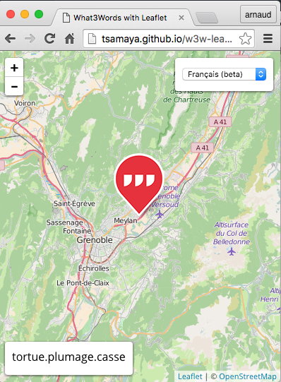

# w3w-leaflet

This is a simple what3words sample application using leaflet

## Live
You will need a what3words API key to run the sample [here](//tsamaya.github.io/w3w-leaflet)
Signing for an AI key is simple : [here](http://developer.what3words.com/api-register)

## Resources
* [what3words](//what3words.com)
* [leaflet](http://leafletjs.com/)
